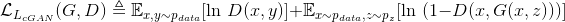

# Pix2Pix

This Git project is a tensorflow re-implementation of Pix2Pix neural networks, inspired directly from **[Image-to-image Translation with conditional Adversarial Networks](https://arxiv.org/abs/1611.07004)** by P. Isola, J. Zhu, T. Zhou and A. Efros (2016).
Original implementation and additional information exist [here](https://phillipi.github.io/pix2pix/). The aim of our project is to implement from scratch cGANs with tensorflow. 

## Pix2Pix in short

### Objective

The original paper aims at building a *simple* but agnostic architecture (*ie not application-specific*) applicable to many image-to-image translation problems such as :
- labels to street views
- aerial to map
- day to night
- edges to photo

The Generative Adversarial Network framework fits particularly well these constraints, and the focus is laid on conditional GANs (cGANs) which learn a conditional generative model, suitable for the image-to-image framework where there is an intrinsic notion of label (we do not want to randomly draw sample from a distribution on natural images, hence the conditional constraint).

The formal objective is composed of two terms :

- the traditional adversarial learning loss between generator and discriminator (with log trick) :

- an additional L1 regularization on generator :

### Architecture

**Generator with skips :** The generator structure is similar to an encoder-decoder except with mirror skip connections. Justification from paper : *"For many image translation problems, there is a great deal of low-level information shared between the input and output, and it would be desirable to shuttle this information directly across the net"*.

**Discriminator on pixels (PatchGAN) :** The discriminator is built by assuming that the L1 regularization constraint on the generator enforces the low-frequencies correctness, so that it only has to focus on high frequencies. As such, the choice is made to focus on the patch scale. 

### Optimization and inference

Standard optimization using minibatch SGD (alternating gradient descent on G and D, one-step each), with ADAM solver. Dropout is also applied to account for stochasticity in generator (deterministic outputs is one issue of cGANs), but should be considered as part of the generative process rather than an additional regularization constraint because it was chosen to be kept during the test phase.

*Importance normalization* was also used (aka batch normalization using test data statistics for batch size of 1 during testing phase).
